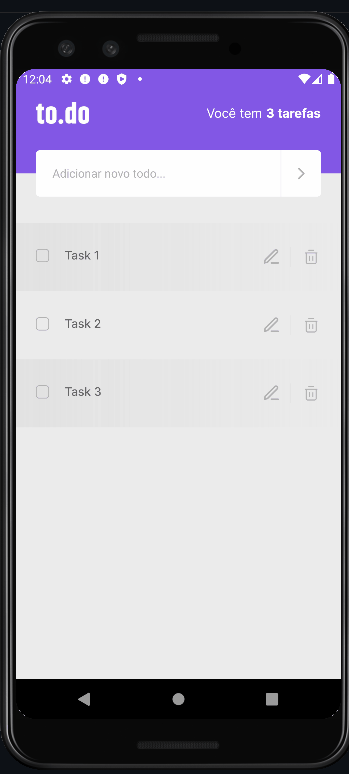

[](./LICENSE)
<div align="center">
  
</div>
<h4 align="center">Desafio 02 - Adicionando edição e alertas 🚀</h4>
<p align="center">
 <a href="#sobre">Sobre</a> •
 <a href="#funcionalidades">Funcionalidades</a> • 
 <a href="#resultado">Resultado</a> • 
 <a href="#executar">Como executar</a> • 
 <a href="#autor">Autor</a>
</p>

<h3 id="sobre">Sobre</h3>
<p>Este é o segundo desafio da trilha de React Native do Ignite da Rocketseat! 🚀</p>
<p>Essa será uma continuação da aplicação de lembrete de tarefas desenvolvida no desafio anterior, onde iremos treinar um pouco mais sobre propriedades e componentização no React.</p>

<h3 id="funcionalidades">Funcionalidades</h3>
<ul>
  <li>Edição de uma tarefa</li>
  <li>Exibir alerta pedindo confirmação ao remover uma tarefa</li>
  <li>Exibir alerta ao tentar adicionar tarefa com o mesmo nome</li>
</ul>

<h3 id="funcionalidades">Resultado</h3>
<div align="center">
  
</div>

<h3 id="executar">Como executar</h3>

```bash
# Clone este repositório
$ git clone git@github.com:davidsonmarra/ignite-RN-desafio-02.git
# Acesse a pasta do projeto no seu terminal/cmd
$ cd ignite-RN-desafio-02
# Instale as dependências
$ yarn install
# Rode o Metro Bundler
$ yarn start
# Execute a aplicação no emulador
$ yarn android
# A aplicação será aberta no emulador
```

---


<h3 id="autor">Autor</h3>
<table>
  <tr>
    <td align="center">
      <a href="https://github.com/davidsonmarra">
        <br>
        <sub>
          <b>Davidson Marra</b>
        </sub>
      </a>
    </td>
  </tr>
</table>